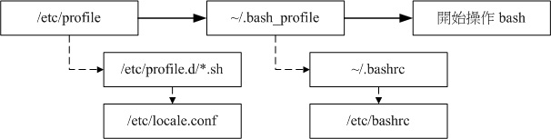

## BASH学习

##### bash shell 功能介绍：
* 命令编修能力	(history):

记忆功能，只要在命令行按“上下键”就可以找到前/后一个输入的指令!而在很多distribution里头,默认的指令记忆功能可以到达1000个，这些指令历史记录被存在在`~/.bash_history	`里面;(ps:`.bash_history`里存在的是当前用户上次登陆使用过的指令，本次使用的指令会存在内存中)。

* 命令与文件补全功能:

在下达指令是我们可以使用`Tab`键进行补全；

* 命令别名设置功能:

当指令太长时我们可以设置别名；如下：
`alias lm='ls -al'`这样我们就可以直接输入`lm`来代替后面的指令了。

* 工作控制、前景背景控制:

* 程序化脚本:

##### 查询指令是否为	Bash	shell	的内置命令:	type

为了方便shell的操作,其实bash已经“内置”了很多指令了,例如上面提到的cd,	还有例如umask	等等的指令,都是内置在bash当中;那我们如何知道哪个指令是否为bash内置呢我们可以通过`type`指令来查询：
>type	[-tpa]	name
选项与参数:
:不加任何选项与参数时,type会显示出name是外部指令还是bash内置指令
-t:当加入-t参数时,type会将name以下面这些字眼显示出他的意义:
file:表示为外部指令;
alias:表示该指令为命令别名所设置的名称;
builtin:表示该指令为bash内置的指令功能;
-p:如果后面接的name为外部指令时,才会显示完整文件名;
-a:会由PATH变量定义的路径中,将所有含name的指令都列出来,包含alias

##### 指令的下达与快速编辑按钮
1),如果指令串太长的话,如何使用两行来输出? `\[Enter]`注意`Enter`键紧跟`\`后面；中间不要有空格。
>[dmtsai@study	~]$	cp	/var/spool/mail/root	/etc/crontab `\`
&gt;	/etc/fstab	/root

2），其他常用编辑快捷键；
|热键|说明|
|----|----|
|[ctrl]+u/[ctrl]+k|分别是从光标处向前删除指令串	([ctrl]+u)	及向后删除指令串([ctrl]+k)。|
|[ctrl]+a/[ctrl]+e|分别是让光标移动到整个指令串的最前面	([ctrl]+a)	或最后面([ctrl]+e)。|

#### Shell的变量功能

进入`shell`系统会生成一些影响`bash`的环境变量；如：`PATH、HOME、MAIL、SHELL	等等`;除些之外用户也可以自定义变量；

##### 变量的取用与设置:echo,	变量设置规则,	unset

* 变量的取用:echo
>echo	${PATH}

* 变量定义：`=`
>myvar=helloword
myvar='hello word' //带空格的纯文本
myvar="${PATH} hello word" //加入其他变量
myvar="$(uname -r) hello word" //加入其他指令用$()

ps:
1）变量不能以数字开头，`=`两边不要出现空格；值若存在空格则需要要单引号或双引号包裹；单引与双引的区别，单引内如`$`这种特殊字符会以纯文本输出 。
2）环境变量：以全部大写命名。如`PATH`
3)输出或调用变量时最好是以`${}`形式，如上面`myvar="${PATH} hello world"`

* `export`将变量变成环境变量
父程序的自订变量是无法在子程序内使用的。但是通过export将变量变成环境变量后,就能够在子程序下面应用了;
>[dmtsai@study	~]$	name=VBird
[dmtsai@study	~]$	bash								&lt;==进入到所谓的子程序
[dmtsai@study	~]$	echo	$name		&lt;==子程序:再次的	echo	一下;
							&lt;==嘿嘿!并没有刚刚设置的内容喔!
[dmtsai@study	~]$	exit								&lt;==子程序:离开这个子程序
[dmtsai@study	~]$	export	name
[dmtsai@study	~]$	bash								&lt;==进入到所谓的子程序
[dmtsai@study	~]$	echo	$name		&lt;==子程序:在此执行!
VBird		&lt;==看吧!出现设置值了!
[dmtsai@study	~]$	exit								&lt;==子程序:离开这个子程序

* 取消刚刚设置的变量
> unset myvar

##### 环境变量的功能
* env	观察环境变量与常见环境变量说明
>[dmtsai@study	~]$ env

>HOSTNAME=study.centos.vbird				&lt;==	这部主机的主机名称
TERM=xterm				&lt;==	这个终端机使用的环境是什么类型
SHELL=/bin/bash				&lt;==	目前这个环境下,使用的	Shell	是哪一个程序?
HISTSIZE=1000	&lt;==	“记录指令的笔数”在	CentOS	默认可记录	1000	笔
OLDPWD=/home/dmtsai&lt;==	上一个工作目录的所在
LC_ALL=en_US.utf8		&lt;==	由于语系的关系,鸟哥偷偷丢上来的一个设置
USER=dmtsai			&lt;==	使用者的名称啊!
LS_COLORS=rs=0:di=01;34:ln=01;36:mh=00:pi=40;33:so=01;35:do=01;35:bd=40;33;01:cd=40;33;01:
or=40;31;01:mi=01;05;37;41:su=37;41:sg=30;43:ca=30;41:tw=30;42:ow=34;42:st=37;44:ex=01;32:
*.tar=01...			&lt;==	一些颜色显示
MAIL=/var/spool/mail/dmtsai				&lt;==	这个使用者所取用的	mailbox	位置
PATH=/usr/local/bin:/usr/bin:/usr/local/sbin:/usr/sbin:/home/dmtsai/.local/bin:/home/dmtsai/bin
PWD=/home/dmtsai			&lt;==	目前使用者所在的工作目录	(利用	pwd	取出!)
LANG=zh_TW.UTF-8			&lt;==	这个与语系有关,下面会再介绍!
HOME=/home/dmtsai		&lt;==	这个使用者的主文件夹啊!
LOGNAME=dmtsai&lt;==	登陆者用来登陆的帐号名称
_=/usr/bin/env					&lt;==	上一次使用的指令的最后一个参数(或指令本身)


* 环境变量 `PS1`说明：

我们通过这个变量可以更改我们的命令提示符格式；以下是一些格式符号的意义：
>\d	:可显示出“星期	月	日”的日期格式,如:"Mon	Feb	2"
\H	:完整的主机名称。举例来说,鸟哥的练习机为“study.centos.vbird”
\h	:仅取主机名称在第一个小数点之前的名字,如鸟哥主机则为“study”后面省略
\t	:显示时间,为	24	小时格式的“HH:MM:SS”
\T	:显示时间,为	12	小时格式的“HH:MM:SS”
\A	:显示时间,为	24	小时格式的“HH:MM”
\@	:显示时间,为	12	小时格式的“am/pm”样式
\u	:目前使用者的帐号名称,如“dmtsai”;
\v	:BASH	的版本信息,如鸟哥的测试主机版本为	4.2.46(1)-release,仅取“4.2”显示
\w	:完整的工作目录名称,由根目录写起的目录名称。但主文件夹会以	~	取代;
\W	:利用	basename	函数取得工作目录名称,所以仅会列出最后一个目录名。
\#	: 下达的第几个指令。
$	:提示字符,如果是	root	时,提示字符为	#	,否则就是	$	啰~

> PS1='[\u@\h \w \A\#]\$'

提示字符将变成如下:


* $:(关于本	shell	的	PID)

想要知道我们的	shell的	PID	,就可以用:“	echo $$	”即可。

* ?:(关于上个执行指令的回传值)
* OSTYPE,	HOSTTYPE,	MACHTYPE:(主机硬件与核心的等级)

* export:	自订变量转成环境变量

>export 变量名称

#### 变量键盘读取、阵列与宣告:	read,	array,	declare

* `read` 读取键盘输入：
>[dmtsai@study	~]$	read	[-pt]	variable
选项与参数:
-p		:后面可以接提示字符!
-t		:后面可以接等待的“秒数!”这个比较有趣~不会一直等待使用者啦!
范例一:让使用者由键盘输入一内容,将该内容变成名为	atest	的变量
[dmtsai@study	~]$	read	atest
This	is	a	test	&lt;==此时光标会等待你输入!请输入左侧文字看看
[dmtsai@study	~]$	echo	${atest}
This	is	a	test	&lt;==你刚刚输入的数据已经变成一个变量内容!
范例二:提示使用者	30	秒内输入自己的大名,将该输入字串作为名为	named	的变量内容
[dmtsai@study	~]$	read	-p	"Please	keyin	your	name:	"	-t	30	named
Please	keyin	your	name:	VBird	Tsai			&lt;==注意看,会有提示字符喔!
[dmtsai@study	~]$	echo	${named}
VBird	Tsai		&lt;==输入的数据又变成一个变量的内容了!

* declare/typeset定义变量类型：

declare与typeset两都完成的是一样的功能,都是定义变量类型；当指令后面不接变量名称时，那么bash就会主动的将所有的变量名称与内容通通列出来;如同`set`指令。

>[dmtsai@study	~]$	declare	[-aixr]	variable
选项与参数:
-a :将后面名为	variable	的变量定义成为阵列	(array)	类型
-i :将后面名为	variable	的变量定义成为整数数字	(integer)	类型
-x :用法与	export	一样,就是将后面的	variable	变成环境变量;
-r :将变量设置成为	readonly	类型,该变量不可被更改内容,也不能	unset

例子：
>jqy@jqy-ThinkPad-T430:~$ total=100+200+60
jqy@jqy-ThinkPad-T430:~$ echo ${total}
100+200+60
jqy@jqy-ThinkPad-T430:~$ typeset -i total=100+200
jqy@jqy-ThinkPad-T430:~$ echo ${total}
300

由于在默认的情况下面,`bash`对于变量有几个基本的定义:
1)变量类型默认为“字串”,所以若不指定变量类型,则1+2为一个“字串”而不是“计算式”。
2)所以上述第一个执行的结果才会出现那个情况的;bash环境中的数值运算,默认最多仅能到达整数形态,所以	1/3	结果是	0;

>范例二:将	sum	变成环境变量
[dmtsai@study	~]$	declare	-x	sum
[dmtsai@study	~]$	export	&#124;	grep	sum
declare	-ix	sum="450"		&lt;==果然出现了!包括有	i	与	x	的宣告!
范例三:让	sum	变成只读属性,不可更动!
[dmtsai@study	~]$	declare	-r	sum
[dmtsai@study	~]$	sum=tesgting
-bash: sum: readonly variable &lt;==老天爷~不能改这个变量了!
范例四:让 sum 变成非环境变量的自订变量吧!
[dmtsai@study ~]$ declare +x sum &lt;== 将 - 变成 + 可以进行“取消”动作
[dmtsai@study ~]$ declare -p sum &lt;== -p 可以单独列出变量的类型
declare -ir sum="450" &lt;== 看吧!只剩下 i, r 的类型,不具有	x

#### 变量内容的删除、取代与替换	(Optional)
* 变量的删除与替换
>`变量#关键字`从头开始删除后面匹配字符（匹配最短）
`变量##关键字`从头开始删除后面匹配字符（匹配最长）
`变量%关键字`从尾开始删除后面匹配字符（匹配最短）
`变量%%关键字`从尾开始删除后面匹配字符（匹配最长）
`变量/旧关键字/新关键字`替换第一个匹配的旧关键字
`变量//旧关键字/新关键字`替换所有匹配的旧关键字

如：
>jqy@jqy-ThinkPad-T430:~$ path=${PATH}
jqy@jqy-ThinkPad-T430:~$ echo ${path}
/usr/local/sbin:/usr/local/bin:/usr/sbin:/usr/bin:/sbin:/bin:/usr/games:/usr/local/games:/snap/bin
jqy@jqy-ThinkPad-T430:~$ echo ${path#/*/sbin:}
/usr/local/bin:/usr/sbin:/usr/bin:/sbin:/bin:/usr/games:/usr/local/games:/snap/bin
jqy@jqy-ThinkPad-T430:~$ echo ${path##/*:}
/snap/bin
jqy@jqy-ThinkPad-T430:~$ echo	${path/sbin/SBIN}
jqy@jqy-ThinkPad-T430:~$ echo	${path//sbin/SBIN}

* 变量的测试与赋值

|变量设置方式|str没有设置|str为空字符|str	已设置非为空字串|
| ----- | ----- |-----| ----- |
|var=${str-expr}|var=expr|var=|var=$str|
|var=${str:-expr}|var=expr|var=expr|var=$str|
|var=${str+expr}|var=|var=expr|var=expr|
|var=${str:+expr}|var=|var=|var=expr|
|var=${str=expr}|str=expr	var=expr|str	不变	var=|str 不变 var=$str|
|var=${str:=expr}|str=expr	var=expr|str=expr	var=expr|str 不变 var=$str|
|var=${str?expr}|expr	输出至	stderr|var=|var=$str|
|var=${str?expr}|expr	输出至	stderr|expr	输出至	stderr|var=$str|

##### Bash	Shell	的操作环境

* 路径与指令搜寻顺序

指令运行的顺序可以这样看:
>1.以相对/绝对路径执行指令,例如“	/bin/ls	”或“	./ls	”;
2.由	alias	找到该指令来执行;
3.由	bash	内置的	(builtin)	指令来执行;
4.通过	$PATH	这个变量的顺序搜寻到的第一个指令来执行。

我们也可以通过`type -a 指令`来查看运行顺序。

* bash	的进站与欢迎讯息:	/etc/issue,	/etc/motd

我们在切换终端接口（tty1~tty6）登入时，会看到几行提示字符，这就是欢迎信息了。我们可以通过登入`root`用户对`/etc/issue`进行修改来更改信息。

issue	内的各代码意义：
| 代码意义 |
|----|
|\d	本地端时间的日期;|
|\l	显示第几个终端机接口;|
|\m	显示硬件的等级	(i386/i486/i586/i686...);|
|\n	显示主机的网络名称;|
|\O	显示	domain	name;|
|\r	操作系统的版本	(相当于	uname	-r)|
|\t	显示本地端时间的时间;|
|\S	操作系统的名称;|
|\v	操作系统的版本。|

PS：我们如果想更改远程登陆系统时显示的欢迎信息，那我们就要改同目录下的
`issue.net`文件了
如果您想要让使用者登陆后取得一些讯息,例如您想要让大家都知道的讯息,	那么可以将讯息加入`/etc/motd`里面去。
记得以上修改都要以`root`用户进行修改。

##### bash	的环境配置文件

在进入`bash`进，系统的一些配置文件会被读取，所以我们能用到很多全局变量；下面我们介绍哪些配置文件会被读取及文件的意义，在此之前我们先区分 `login shell`与`non-login shell`;因为两种情况读取的配置文件并不一样。
>1,login shell:取得bash时需要完整的登陆流程的,就称为loginshell。举例来说,你要由tty1~tty6	登陆,需要输入使用者的帐号与密码,此时取得的	bash	就称为“	login	shell”
2,non-login	shell:取得bash接口的方法不需要重复登陆的，如：X window登陆Linux后,再以X的图形化接口启动终端机;你在原本的	bash	环境下再次下达	bash这个指令,同样的也没有输入帐号密码,那第二个bash(子程序)也是non-login	shell	

* `login shell`读取的文件：

1，/etc/profile:这是系统整体的设置,最好不要修改这个文件；
	这个文件主要设置了一些环境变量，及读取一些其他文件，可能包括如下一些：

>`/etc/profile.d/*.sh`;profile.d下的一些.sh文件;如果你需要帮所有使用者设置一些共享的命令别名时,	可以在这个目录下面自行创建扩展名为	.sh	的文件,并将所需要的数据写入即可；
`/etc/locale.conf`bash	默认使用何种语系的重要配置文件;
`/usr/share/bash-completion/completions/*`bash自动补全（Tab）功能的一些配置。

2,个人设置文件：
`~/.bash_profile或~/.bash_login或~/.profile`中的一个以排前的优先，如果存在后面的则不会读取；	login shell才会读；

整个login shell读取配置流程如下:



`.~/.bashrc	`(non-login	shell会读)
此文件设置了一些别名；

##### `source/.`指令
我们一般对上节的配置文件做了修改后，取要重新进入bash才会生效；我们也可以利用`source`(也可以以`.`代替)指令直接加载配置进来；
>source	~/.bashrc //与下面指令同效
. ~/.bashrc

#### 数据流重导向

* 标准输入  (stdin)	:代码为	0	,使用	`<	或	<<`;
* 标准输出  (stdout):代码为	1	,使用	`>	或	>>`;
* 标准错误输出(stderr):代码为	2	,使用	`2>	或	2>>`;

一般情况我们不使用数据导向的话，标准输出与标准错误输出都是直接输出到屏幕。我们可以通上面的导向符，把标准输出与错误输出导向不同的地方，如：文件或其他设备。
例子1：
>`ll / > ~/text.txt` //输出数据到/HOME目录下的text.txt（没有会新建）
`ll ~ > ~/text.txt`

`>`导向符会以覆盖的形式展出，如上面第二次指令输出会把第一次输出的数据给覆盖。要想以追加的形式我们可以使用`>>`。

如果标准输出`> 或 >>`与标准错误输出符`2>或2>>`都存在的话，那我们要在标准输出符前加个`1`。

>1>	:以覆盖的方法将“正确的数据”输出到指定的文件或设备上;
1>>:以累加的方法将“正确的数据”输出到指定的文件或设备上;
2>	:以覆盖的方法将“错误的数据”输出到指定的文件或设备上;
2>>:以累加的方法将“错误的数据”输出到指定的文件或设备上;

例子2：
我们要把某指令产生的正确信息放一文件`info_right`，产生的错误导向另一文件`info_error`我们可以如下操作：
>find /home -name .bashrc 1> info_right 2> info_error

如果要导向同文件，为了避免写入冲突及混乱；你可以使用`2>&1`也可以使用`&>`

>find /home -name .bashrc > info 2>&1
find /home -name .bashrc &> info

接下来我们再来看看输入字符`<或<<`的用法。

我们先看例子：
>cat > myfile.txt
this is a test file.
hello world

Ctrl+d结束;下面输出的两行信息会被写入到myfile.txt中。那我们可以不可以直接从其他文本文件里面把数据读出并写到myfile.txt中呢？答案是肯定的，我们可以如下操作：
> cat > myfile.txt < ~/.bashrc

这样`～/.bashrc`中的内容就写入到了myfile.txt中；

那`<<`符有什么用呢，它的作用是指定输入结束符。我们前面例子通过按`ctrl+d`来结束，如果想让用户输入`eof`后结束输入我们可以如下指定：

>cat > myfile.txt << eof

用户当输入`eof`之后当前输入就结束了。

#### 命令执行的判断依据:	;	,	&&,	||
* `;`不考虑指定的依赖性及相关性，指令之间可以用`;`分隔一次指定多条指定；
* `&&或||` 我们可以用`&&`或`||`建立起指定的相关性，一条指定执行后会传回一个值`$?`,若`$?=0`则表示指定执行成功。不等于0则表示执行出错。我们可以利用这个回传加上&&或||建立起指定的相关性。
>`cmd1&&cmd2` 若cmd1成功则执行cmd2；否则不执行。
`cmd1||cmd2` 若cmd1成功则不执行cmd2;否则执行。

### 管道命令 `|`
> ls -la /etc | less

上面就是一个简单的管道命令，把ls的输入给后面的less;使用管道命令需要注意两点：
* 管线命令仅会处理 standard output,对于 standard error output 会予以忽略
* 管线命令必须要能够接受来自前一个指令的数据成为	standard	input	继续处理才行。


#### cut,grep指令：
撷取讯息通常是针对“一行一行”来分析的,	并不是整篇讯息分析。这点需要注意！

`cut`指令为截取输入变量的一部分。
>选项与参数:
-d :后面接分隔字符。与	-f 一起使用;
-f :依据 -d 的分隔字符将一段讯息分区成为数段,用 -f 取出第几段的意思;
-c :以字符 (characters) 的单位取出固定字符区间;

例子：
```bash
echo ${PATH} | cut -d ':' -f 3,5 
```
以`:`分割PATH取出第3,5段。

对于排列整齐的输出,我们可以用`-c`来取出想要的部分。例如：
```bash
> export
输出结果：
declare -x CLUTTER_IM_MODULE="xim"
declare -x COMPIZ_BIN_PATH="/usr/bin/"
declare -x COMPIZ_CONFIG_PROFILE="ubuntu"
declare -x DBUS_SESSION_BUS_ADDRESS="unix:abstract=/tmp/dbus-l3eKsWwlVw"
declare -x DEFAULTS_PATH="/usr/share/gconf/ubuntu.default.path"
declare -x DESKTOP_SESSION="ubuntu"
declare -x DISPLAY=":0"
declare -x GDMSESSION="ubuntu"
declare -x GDM_LANG="zh_CN"
...

```
如果我们只想要每行`declare -x`后面的内容；我们可以这样做：
```bash
>export | cut -c 12-
```
12后面的`-`代表至,如果不写表明到行尾，也可以是`12-20,12-15`等等。

`grep` 指令：
grep则是分析一行讯息,若当中有我们所需要的信息,就将该行取出来。
>grep	[-acinv]	[--color=auto]	'搜寻字串'	filename
选项与参数:
-a :将 binary 文件以 text 文件的方式搜寻数据
-c :计算找到 '搜寻字串' 的次数
-i :忽略大小写的不同,所以大小写视为相同
-n :顺便输出行号
-v :反向选择,亦即显示出没有 '搜寻字串' 内容的那一行!
--color=auto :可以将找到的关键字部分加上颜色的显示喔!

例子：
`last`指令用于输出登陆历史记录；如：
```bash
>last
输出:
jqy      tty7         :0               Thu Dec 28 05:48    gone - no logout
reboot   system boot  4.4.0-98-generic Thu Dec 28 05:48   still running
reboot   system boot  4.4.0-98-generic Wed Dec 27 13:46 - 13:47  (00:00)
reboot   system boot  4.4.0-98-generic Mon Dec 25 20:40 - 20:40  (00:00)
reboot   system boot  4.4.0-98-generic Sat Dec 23 18:14 - 18:15  (00:00)
...
```
我们想取出有用户`jqy`的行,可以如下操作：
```bash
>last | grep -n 'jqy'
```
### 排序命令:	sort,	wc,	uniq


