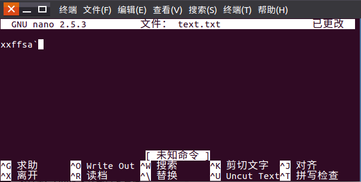

#### 常用指令使用：
##### `nano`文本编辑器使用。
>nano 11.txt

如果`11.txt`存在则打开，如果不存在则为新文件;

##### `^`代表`Ctrl`;  `M-`代表`alt`

#### 常用的关机命令：
>将数据同步写入硬盘中的指令:	sync
惯用的关机指令:	shutdown
重新开机,关机:	reboot,	halt,	poweroff

#### cp,rm,mv 指令

* `cp`指令：
>[root@study	~]#	cp	[-adfilprsu]	来源文件(source)	目标文件(destination)
[root@study	~]#	cp	[options]	source1	source2	source3	....	directory
选项与参数:
-a ：相当于	-dr	--preserve=all	的意思,至于	dr	请参考下列说明;(常用)
-d ：若来源文件为链接文件的属性(link	file),则复制链接文件属性而非文件本身;
-f ：为强制(force)的意思,若目标文件已经存在且无法打开,则移除后再尝试一次;
-i ：若目标文件(destination)已经存在时,在覆盖时会先询问动作的进行(常用)
-l ：进行硬式链接(hard	link)的链接文件创建,而非复制文件本身;
-p ：连同文件的属性(权限、用户、时间)一起复制过去,而非使用默认属性(备份常用);
-r ：递回持续复制,用于目录的复制行为;(常用)
-s ：复制成为符号链接文件	(symbolic	link),亦即“捷径”文件;
-u ：destination	比	source	旧才更新	destination,或	destination	不存在的情况下才复制。
--preserve=all	:除了	-p	的权限相关参数外,还加入	SELinux	的属性,	links,	xattr	等也复制了。
最后需要注意的,如果来源文件有两个以上,则最后一个目的文件一定要是“目录”才行!

常用练习：
> `cp /usr/src/bb.txt  ./ff.txt`  //复制 bb.txt并改名ff.txt
`cp -r /usr/src /tmp` //复制目录到`/tmp`
`cp -r /usr/src/* /tmp/cpsrc` 复制目录/usr/src下的文件及目录到/tmp/cpsrc
`cp -l ./rar/readme.txt ./readme_l.txt ` 创建实体连接
`cp -s ./rar/readme.txt ./readme_s.txt ` 创建符号连接
`cp -a /usr /bkusr` 备份/usr（保留相关属性,ps:由于普通用户身份并不能随意修改文件的拥有者与群组,因此虽然能够复制的相关权限与时间等属性,	但是与拥有者、群组相关的,普通用户身份无法进行的动作,即使加上	-a	选项,也是无法达成完整复制权限的!所以备份最好用`root`用户）

* rm指令：
>选项与参数:
-f :就是	force	的意思,忽略不存在的文件,不会出现警告讯息;
-i :互动模式,在删除前会询问使用者是否动作
-r :递回删除啊!最常用在目录的删除了!这是非常危险的选项!!!

常用练习：
>rm -i aa.txt   //删除前询问
rm -r ./cc //删除目录
rm  ./-aa- 删除以‘-’开头的文件

ps:`root`用户因身份特殊默认带有`-i`参数

* mv指令：

>-f :force	强制的意思,如果目标文件已经存在,不会询问而直接覆盖;
-i :若目标文件	(destination)	已经存在时,就会询问是否覆盖!
-u :若目标文件已经存在,且	source	比较新,才会更新	(update)

常用练习：
>mv aa.txt ./back   //将文件aa.txt移动到back文件中
mv aa.txt cc.txt //更改文件名称
mv ./back ./backup //更改文件夹名称。
