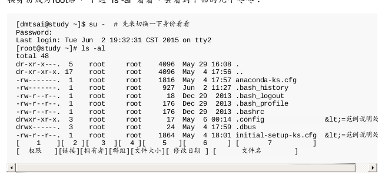
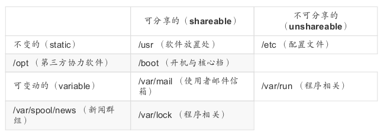

#### 文件权限与目录
##### 文件属性
我们可以利用`ls -al`来查看文件或目录的属性；执行后如下图：

##### 文件类型与权限详解：

* 第一个字符代表这个文件是“目录、文件或链接文件等等”:
>当为[	d	]则是目录,例如上表文件名为“.config”的那一行;
当为[	-	]则是文件,例如上表文件名为“initial-setup-ks.cfg”那一行;
若是[	l	]则表示为链接文件(link	file);
若是[	b	]则表示为设备文件里面的可供储存的周边设备(可随机存取设备);
若是[	c	]则表示为设备文件里面的序列埠设备,例如键盘、鼠标(一次性读取设
备)。

* 接下来的字符中,以三个为一组,且均为“rwx”	的三个参数的组合。
>[	r	]代表可读(read)、
[	w	]代表可写(write)、
[	x	]代表可执行(execute)。	
要注意的是,这三个权限的位置不会改变,如果没有权限,就会出现减号[	-	]而已。

##### `chgrp,chown chmod`指令使用：

* chgrp:
>chgrp -R	users	./data   //改变DATA文件夹的用户组，
-R :	进行递回(recursive)的持续变更,亦即连同次目录下的所有文件、目录
都更新成为这个群组之意。常常用在变更某一目录内所有的文件之情况。

* chown:
>chown	[-R]	帐号名称	文件或目录
 chown	[-R]	帐号名称:群组名称	文件或目录
选项与参数:
-R	:	进行递回(recursive)的持续变更,亦即连同次目录下的所有文件都变更

例如：
>chown	zhangsan initial-setup-ks.cfg
chown root:root initial-setup-ks.cfg //把用户及群组都改回root

* chmod:
修改文件或文件夹的权限，有两种形式的修改：一种是数字型，一种是字符型运算。

1,数字型：

Linux文件的基本权限就有九个,分别是owner/group/others三种身份各有自己的read/write/execute权限:如：`-rwxr-xr-x` 其中分值如下:
>r:4	>	w:2	>	x:1

如：
>chmod -R 755 ./data
//-R :进行递回(recursive)的持续变更,亦即连同次目录下的所有文件都会变更

2,字符型运算：
基本上就九个权限分别是
(1)user	(2)group	(3)others三种身份啦!
那么我们就可以借由`u,g,o`来代表三种身份的权限!此外,`a`则代表all亦即全部的身份!
那么读写的权限就可以写成`r,w,x`;

例如：
>chmod u=rwx,go=rx .bashrc // 改变权限为`-rwxr-xr-x`

##### 文件与目录的权限意义：

1,权限字符对文件的意义：

>r	(read):可读取此一文件的实际内容,如读取文本文件的文字内容等;
w	(write):可以编辑、新增或者是修改该文件的内容(但不含删除该文件);
x	(eXecute):该文件具有可以被系统执行的权限。

2,权限字符对目录的意义：
>r:
表示具有读取目录结构清单的权限,所以当你具有读取(r)一个目录的权限时,表示你可以查询该目录下的文件名数据。	所以你就可以利用	ls	这个指令将该目录的内容列表显示出来!
w:
这个可写入的权限对目录来说,是很了不起的!	因为他表示你具有异动该目录结构清单的权限,也就是下面这些权限:
1)创建新的文件与目录;
2)删除已经存在的文件与目录(不论该文件的权限为何!)
3)将已存在的文件或目录进行更名;
4)搬移该目录内的文件、目录位置。	
总之,目录的w权限就与该目录下面的文件名异动有关就对了啦!
x:
目录的x代表的是使用者能否进入该目录成为工作目录。（利用 `cd`进入目录作为工作目录）

##### Linux目录配置：
为了便于管理系统内的应用及文件；我们尽量遵循FHS的标准；来放置我们的软件及文件；

几个比较重要的目录介绍：
>`/bin` ： 系统有很多放置可执行文件的目录,但/bin比较特殊。因为/bin放置的是在单人维护模式下还能够被操作的指令。	在/bin下面的指令可以被root与一般帐号所使用,主要有:cat,	chmod,	chown,	date,	mv,	mkdir,	cp,	bash等等常用的指令。
`/boot` :这个目录主要在放置开机会使用到的文件,包括Linux核心文件以及开机菜单与开机所需配置文件等等。	Linux	kernel常用的文件名为:vmlinuz,如果使用的是grub2这个开机管理程序,	则还会存在/boot/grub2/这个目录喔!
`/dev` :在Linux系统上,任何设备与周边设备都是以文件的型态存在于这个目录当中的。	你只要通过存取这个目录下面的某个文件,就等于存取某个设备啰~	比要重要的文件有/dev/null,	/dev/zero,	/dev/tty,	/dev/loop,	/dev/sd等等
`/etc` :系统主要的配置文件几乎都放置在这个目录内,例如人员的帐号密码档、各种服务的启始档等等。一般来说,这个目录下的各文件属性是可以让一般使用者查阅的,	但是只有root有权力修改。FHS建议不要放置可可执行文件(binary)在这个目录中喔。比较重要的文件有:	/etc/modprobe.d/,/etc/passwd,	/etc/fstab,	/etc/issue	等等。另外	FHS	还规范几个重要的目录最好要存在	/etc/	目录下喔:/etc/opt(必要):这个目录在放置第三方协力软件	/opt	的相关配置文件	/etc/X11/(建议):与	X	Window	有关的各种配置文件都在这里,尤其是	xorg.conf	这个	X	Server	的配置文件。	/etc/sgml/(建议):与	SGML	格式有关的各项配置文件	/etc/xml/(建议):与	XML格式有关的各项配置文件
`/opt`:这个是给第三方协力软件放置的目录。什么是第三方协力软件啊?	举例来
说,KDE这个桌面管理系统是一个独立的计划,不过他可以安装到Linux系统中,因此KDE的软件就建议放置到此目录下了。	另外,如果你想要自行安装额外的软件(非原本的distribution提供的),那么也能够将你的软件安装到这里来。	不过,以前的Linux系统中,我们还是习惯放置在/usr/local目录下呢!
`/srv` :srv可以视为“service”的缩写,是一些网络服务启动之后,这些服务所需要
取用的数据目录。	常见的服务例如WWW,	FTP等等。举例来说,WWW服务器需要的网页数据就可以放置在/srv/www/里面。	不过,系统的服务数据如果尚未要提供给网际网络任何人浏览的话,默认还是建议放置到	/var/lib下面即可。
`/usr,/var`: 第二层FHS设置;

